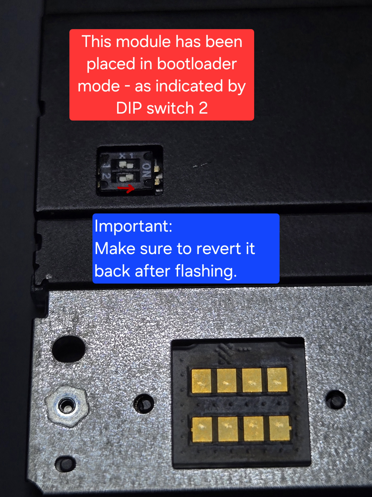

# Framework 16 - RGB LED Matrix Input Module [micropython]

This is micropython code for driving __Joe Schroedl__'s RGB LED Matrix Input Module.

## Installation: [Easiest Method]
1. GENTLY flip dip switch 2 on the Input Module towards the 'ON' label with tweezers. 
3. Reinstall all Input Modules as well as the trackpad onto the Framework 16 machine.
4. Copy the 'LEDMatrix.uf2' file from the latest tagged GitHub release onto the 'RPI-RP2' mass-storage disk.
    * __Alternatively:__ `picotool load LEDMatrix.uf2`
5. Remove the Input Module and GENTLY put dip switch 2 back into the off position.
6. Reinstall all Input Modules - the micropython device will be detected - and everything should work
`Bus 001 Device 095: ID 2e8a:0005 Joe Schroedl LED Matrix Module`

After installation - Thonny can be used to open and edit the running script.
